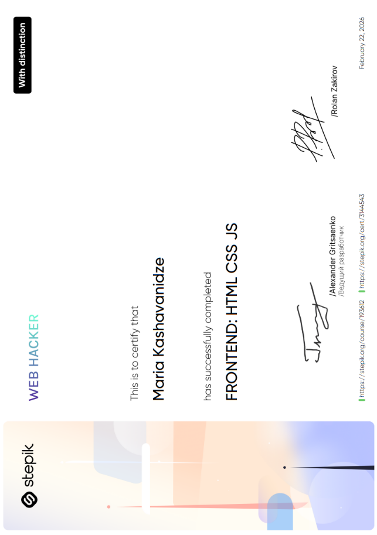
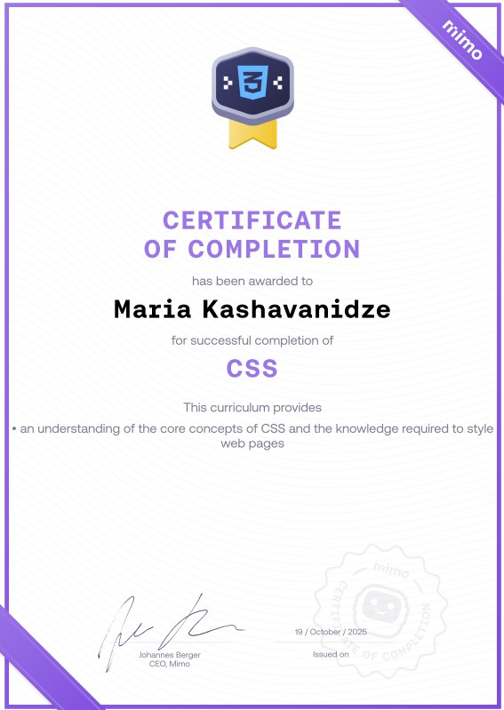
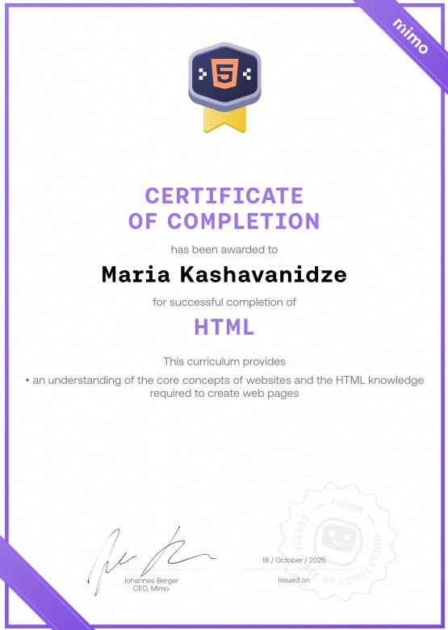
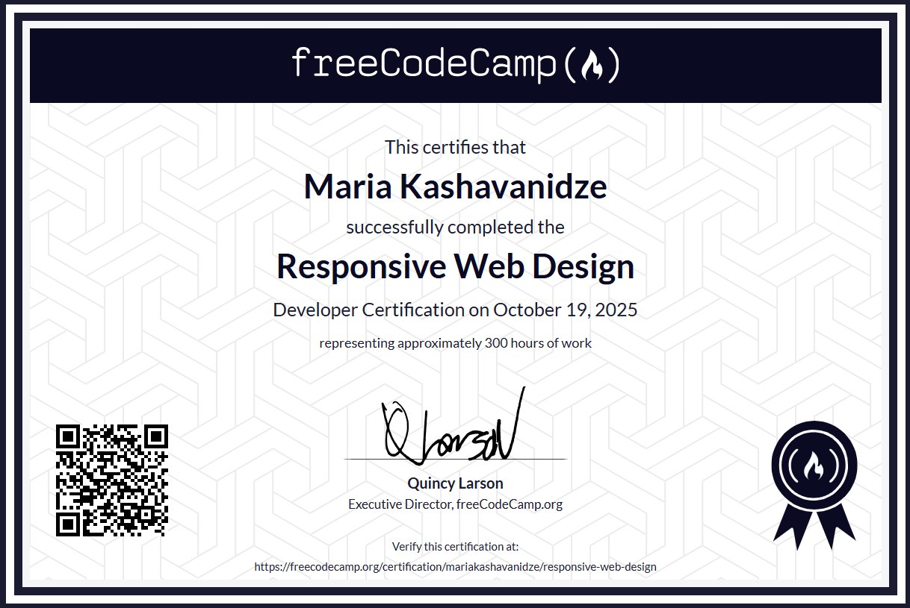

  

   
   

  

  

   
   

  

  

---

## 👻 About Me

Hi! I'm **Maria Kashavanidze**, also known online as **@marymaryyia**.

I'm a passionate **Full-Stack Developer** who enjoys turning ideas into interactive, useful, and visually engaging digital experiences.

I love building projects from the ground up — from designing user interfaces and developing web applications to creating mobile experiences and working with databases.

I'm always curious about new technologies and enjoy learning by building real projects, solving problems, and experimenting with new ideas.

I enjoy working across both **frontend and backend development**, with a particular interest in creating modern interfaces and building applications that are both functional and enjoyable to use.

## 🛠 Tech Stack

## 🌱 Currently Learning

<h2>🏆 Certificates & Achievements</h2>

 

